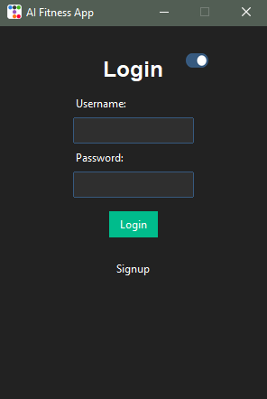
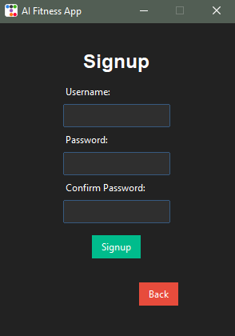
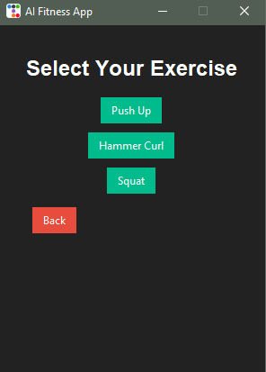
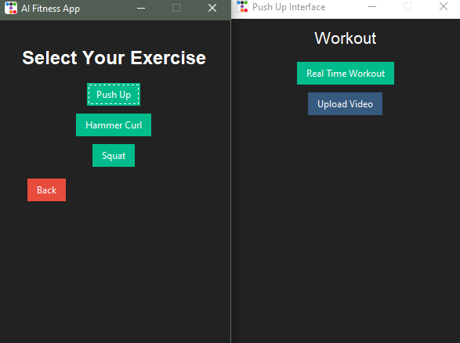
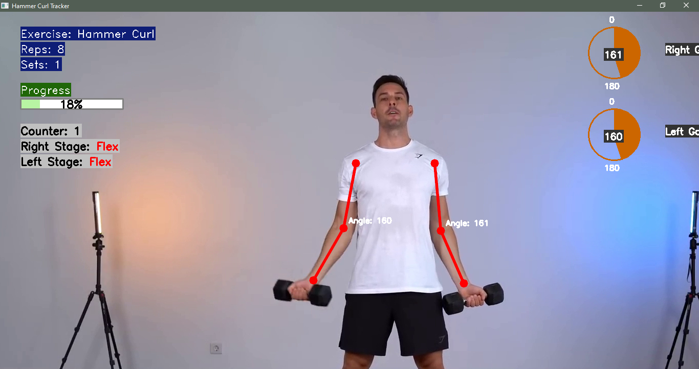

# AI Fitness App

## Overview
The **AI Fitness App** is an intelligent fitness tracking application that uses computer vision to monitor and analyze exercise performance in real-time or from uploaded videos. Built with Python, OpenCV, and a GUI powered by Tkinter and ttkbootstrap, the app supports exercises like Push-Ups, Hammer Curls, and Squats. It provides real-time feedback on exercise form, counts repetitions, and tracks progress, making it ideal for fitness enthusiasts and academic projects.

## Features
- **User Authentication**: Secure login and signup system with password hashing (SHA-256).
- **Exercise Tracking**: Supports Push-Ups, Hammer Curls, and Squats with real-time pose estimation.
- **Real-Time Feedback**: Displays rep counts, joint angles, and form correction warnings.
- **Video Upload**: Analyze pre-recorded videos for exercise performance.
- **Theme Toggle**: Switch between dark and light themes for better user experience.
- **Customizable Interface**: Fixed-size Tkinter GUI with a modern look using ttkbootstrap.

## Requirements
- Python 3.8+
- OpenCV (`opencv-python`)
- ttkbootstrap
- NumPy (used by OpenCV for pose estimation)
- Custom modules: `pose_estimation`, `exercises`, `feedback`, and `utils` (ensure these are in the project directory)

## Installation
1. **Clone the Repository**:
   ```bash
   git clone https://github.com/vishnudev-p/AI-FITNESS-APP.git
   cd AI-FITNESS-APP
   ```

2. **Set Up a Virtual Environment** (optional but recommended):
   ```bash
   python -m venv venv
   source venv/bin/activate  # On Windows: venv\Scripts\activate
   ```

3. **Install Dependencies**:
   ```bash
   pip install opencv-python ttkbootstrap
   ```

4. **Ensure Custom Modules**:
   - Verify that the `pose_estimation`, `exercises`, `feedback`, and `utils` directories/modules are present in the project folder.
   - These modules include `PoseEstimator`, `Squat`, `HammerCurl`, `PushUp`, `layout_indicators`, `get_exercise_info`, and `draw_text_with_background`.

5. **Run the Application**:
   ```bash
   python main.py
   ```

## Usage
1. **Launch the App**:
   - Run `main.py` to open the Tkinter GUI.
   - The app starts with a login screen and a dark theme by default.

2. **Sign Up**:
   - Click the "Signup" button to create a new account.
   - Enter a username and password, then confirm the password.
   - User credentials are saved in `users.txt` with hashed passwords.

3. **Log In**:
   - Enter your username and password to log in.
   - Upon successful login, the exercise selection screen appears.

4. **Select an Exercise**:
   - Choose from Push-Up, Hammer Curl, or Squat.
   - Each exercise opens a new window with options for:
     - **Real-Time Workout**: Uses your webcam to track exercises.
     - **Upload Video**: Analyze a pre-recorded video (supports .mp4, .avi, .mov, .mkv formats).

5. **Exercise Tracking**:
   - The app displays a video feed with overlaid information (exercise name, reps, sets, angles, and warnings).
   - Press `q` to exit the video feed.

6. **Toggle Theme**:
   - Use the toggle button in the login screen to switch between dark and light themes.

## 📸 Screenshots

Visual previews of the AI Fitness App interface:

### 🔐 Login Page
  
*Description*: The initial login interface with username, password fields, and theme toggle.

### 📝 Signup Page
  
*Description*: The signup interface for creating a new user account with username, password, and confirm password fields.

### 🏠 Home Page
  
*Description*: The exercise selection screen where users choose between Push-Up, Hammer Curl, or Squat.

### 🏋️ Push-Up / Hammer Curl Interface
  
*Description*: Interface for selecting real-time workout or video upload for Push-Up or Hammer Curl.

### 📊 Output Interface
  
*Description*: Real-time tracking window showing pose estimation, rep counts, and feedback overlays.

---
*Instructions for Adding Screenshots*:
1. Create a `screenshots` folder in the project directory.
2. Capture screenshots of the app (e.g., using a screen capture tool).
3. Save images as `login_page.png`, `signup_page.png`, `home_page.png`, `pushup_hammer_curl_interface.png`, and `output_interface.png` in the `screenshots` folder.
4. Push the images to the repository.
5. Verify that the image paths in this README match the actual file locations.

## Project Structure
```
AI-FITNESS-APP/
├── main.py                  # Main application script
├── users.txt                # Stores user credentials (auto-generated)
├── pose_estimation/         # Pose estimation logic
│   └── estimation.py
├── exercises/               # Exercise-specific tracking logic
│   ├── squat.py
│   ├── hammer_curl.py
│   └── push_up.py
├── feedback/                # Feedback and UI overlay logic
│   ├── layout.py
│   └── information.py
├── utils/                   # Utility functions
│   └── draw_text_with_background.py
├── screenshots/             # Folder for screenshots (create and add images)
└── README.md                # This file
```

## Notes
- **Dependencies**: Ensure all custom modules (`pose_estimation`, `exercises`, `feedback`, `utils`) are correctly implemented and available in the project directory.
- **Camera/Video**: A working webcam is required for real-time tracking. Ensure the video file is accessible for upload functionality.
- **Git Permissions**: If you encounter push errors (e.g., 403), verify your repository URL and credentials as per the previous conversation:
  ```bash
  git remote set-url origin https://github.com/vishnudev-p/AI-FITNESS-APP.git
  git push -u origin main
  ```

## Contributing
Contributions are welcome! Please fork the repository, create a new branch, and submit a pull request with your changes.

## License
This project is licensed under the MIT License.
